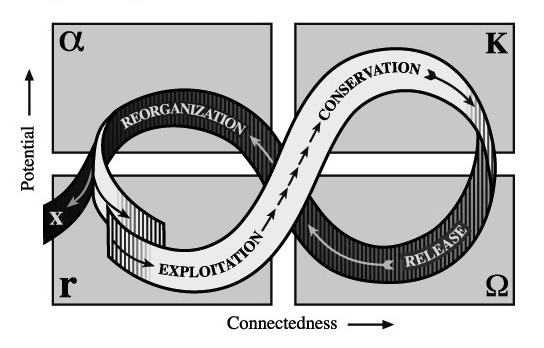

# The Convergence Framework: A Revolution in Adaptive Systems Design

## The Power of Integration

Look, let's be brutally honest here. Most organisations are failing miserably at creating genuinely adaptive systems. They're grabbing random practices from different methodologies, applying them in isolation, and then wondering why they still can't respond quickly to market changes. It's like trying to win Formula 1 by separately optimising the engine, chassis, and tyres without considering how they work together.

The real breakthrough happens when we stop treating Domain-Driven Design, Wardley Mapping, and Team Topologies as separate tools and start seeing them as complementary perspectives within a unified approach. This integration – what we're calling the Convergence Framework – creates something far more powerful than the sum of its parts.

## The Adaptive Loop: Your Survival Mechanism

At the heart of the Convergence Framework lies the Adaptive Loop – a continuous cycle of sensing, analysing, deciding, and acting that enables organisations to respond effectively to change. This isn't just another business process; it's your organisational survival mechanism in an increasingly unpredictable world.

1. **Sense**: Continuously gather signals about changes in your business environment, user needs, technology trends, and system performance. This includes both hard metrics and soft insights from customers, team members, and market analysts.

2. **Analyse**: Apply frameworks like DDD and Wardley Mapping to interpret these signals. Identify patterns, constraints, opportunities, and risks. Assess your current state against business goals.

3. **Decide**: Make informed decisions about system evolution. This includes choices about architecture, technology investments, team structures, and delivery priorities.

4. **Act**: Execute through a combination of technical practices (informed by DDD), strategic plays (guided by Wardley Mapping), and organisational changes (shaped by Team Topologies).

What makes the Adaptive Loop different from typical business planning cycles is its tempo and pervasiveness. The loop operates simultaneously at multiple cadences – from daily at the team level to quarterly at the strategic level – creating a multi-layered sensing and response system that can detect and adapt to change at the appropriate speed.

## Convergence Points: Where the Magic Happens

The real power of the Convergence Framework emerges at specific intersection points where the three approaches reinforce and enhance each other. Let's examine these critical convergence points:

### 1. Bounded Contexts and Value Streams

When we overlay the concept of Bounded Contexts from DDD with value streams from Team Topologies, something remarkable happens. Each Bounded Context – a cohesive domain with clear boundaries – naturally aligns with a value stream that delivers specific customer outcomes.

For example, in a financial services company, the "Customer Onboarding" Bounded Context maps directly to the value stream that transforms prospects into active customers. By aligning team structures with these natural domain boundaries, we create clear ownership and drastically reduce coordination overhead.

Monzo Bank applied exactly this principle when scaling their digital banking platform. By identifying distinct bounded contexts like Account Management, Payments, and Financial Insights, and aligning autonomous stream-aligned teams to each, they were able to evolve different parts of their system independently while maintaining a cohesive customer experience.

### 2. Evolution and Team Topologies

Wardley Mapping provides a strategic lens for anticipating how different components of your system will evolve over time. This evolutionary perspective directly informs how you should structure your teams and their interaction patterns.

Consider a retail company mapping its e-commerce capabilities. Components in the Genesis stage (like a new recommendation engine using cutting-edge AI) need highly collaborative stream-aligned teams with significant autonomy. Components in the Product stage (like the shopping cart) benefit from platform teams that provide standardised, well-tested implementations. Components in the Commodity stage (like payment processing) might be best consumed as external services.

ASOS used this approach to strategically evolve their team structures as their e-commerce platform matured. They shifted from innovation-focused stream-aligned teams for new capabilities to platform teams for mature capabilities, ensuring optimal resource allocation as components evolved.

### 3. Strategic Design and Technology Choice

DDD's Strategic Design patterns help identify which parts of your system are most critical to business success. Wardley Mapping then guides decisions about where to focus technology investments for maximum impact.

For instance, if your DDD analysis identifies Customer Analytics as part of your Core Domain, and Wardley Mapping shows this capability is in the Custom-Built stage but moving toward Product, you might decide to invest heavily in building a differentiated analytics platform now, with plans to leverage more commodity components as the space matures.

The UK's Government Digital Service used exactly this approach when building GOV.UK. They identified which capabilities were strategic differentiators (like user-centered content design) versus generic functions (like content management), and allocated their engineering resources accordingly, creating a system that delivered exceptional citizen experiences while maintaining cost efficiency.

### 4. Collaboration and Cognitive Load

Team Topologies emphasises the importance of managing cognitive load and using appropriate interaction modes between teams. DDD's concepts of Ubiquitous Language and Bounded Context create clear, localised domains of understanding that directly reduce cognitive load.

Spotify's famous squad model exemplifies this convergence. Each squad focuses on a specific domain area, uses a shared language for that domain, and has clear interaction patterns with other squads. This structure minimises the mental overhead of cross-team collaboration while maintaining alignment on the overall product vision.

## Applying the Convergence Framework: A Practical Guide

Implementing the Convergence Framework isn't a one-time project but an iterative journey. Here's a practical roadmap:

1. **Map the Domain**: Use DDD techniques like Event Storming and Domain Storytelling to understand your business domain and identify Bounded Contexts.

   _Example_: TransferWise (now Wise) began their transformation by conducting extensive Event Storming sessions, mapping the entire money transfer journey and identifying distinct contexts like User Verification, Currency Exchange, and Payment Processing.

2. **Map the Value Chain**: Use Wardley Mapping to visualise your value chain, identify the evolutionary stages of different components, and spot opportunities for strategic differentiation.

   _Example_: After mapping their domain, Wise created Wardley Maps for each key capability, identifying which parts of their system provided unique competitive advantage versus which were undifferentiated industry standards.

3. **Design Team Structures**: Based on insights from steps 1 and 2, design team structures and interaction modes that align with the domain and technology evolution.

   _Example_: Wise restructured their engineering organisation to align teams with bounded contexts, with stream-aligned teams for core differentiators like their matching engine and currency conversion algorithms.

4. **Define Evolutionary Roadmaps**: Combine DDD Strategic Design patterns with Wardley Map-derived insights to create technology roadmaps that balance short-term delivery with long-term evolution.

   _Example_: For capabilities identified as strategic but currently in genesis/custom-built phases, Wise created detailed evolution plans showing how teams would transition from experimental approaches to more standardised solutions as the technology matured.

5. **Implement, Measure, and Adapt**: Put designs into action, measure key flow and outcome metrics, and use this data to inform the next iteration of the Adaptive Loop.

   _Example_: Wise established a comprehensive measurement framework tracking not just technical metrics but also team autonomy and cognitive load, using regular retrospectives to continuously refine their approach.

## Benefits of the Convergence Framework

Adopting the Convergence Framework delivers several transformative benefits:

1. **Business-Technology Alignment**: By anchoring technology decisions in domain understanding, the framework ensures IT investments directly support business outcomes. No more "tech for tech's sake" or features disconnected from customer needs.

2. **Evolutionary Architecture**: The combination of DDD and Wardley Mapping enables architectures that evolve gracefully, avoiding both rigid up-front designs and chaotic, unplanned growth.

3. **Flow Optimisation**: Team Topologies principles structure teams for fast, sustainable delivery, while DDD enables clear, localised communication and decision-making.

4. **Strategic Agility**: The continuous sensing and adaptation enables organisations to quickly identify and respond to threats and opportunities, maintaining competitive advantage in volatile markets.

5. **Organisational Resilience**: The modular, evolutionary nature of the resulting systems, combined with adaptive organisational structures, creates inherent resilience to change and disruption.

## Overcoming Implementation Challenges

Let's be realistic – implementing the Convergence Framework isn't without challenges:

1. **Complexity**: Integrating multiple approaches introduces significant complexity, especially in large organisations with entrenched silos.

   _Mitigation_: Start with a pilot in a bounded area of the business, demonstrate success, then expand gradually.

2. **Skills Gap**: The framework requires expertise across strategic thinking, technical architecture, and organisational design.

   _Mitigation_: Invest in training and coaching, bring in external expertise initially, and build internal communities of practice.

3. **Cultural Resistance**: The framework demands a culture of continuous learning and adaptation that may clash with traditional command-and-control approaches.

   _Mitigation_: Focus on demonstrating early wins that create tangible value, involve key stakeholders from the beginning, and explicitly address the "what's in it for me" for different parts of the organisation.

4. **Governance Friction**: Traditional governance models often conflict with the evolutionary approach of the framework.

   _Mitigation_: Redesign governance to focus on outcomes rather than outputs, implement guardrails rather than gates, and educate governance stakeholders on the benefits of adaptive approaches.

## Case Study: Insurance Company Transformation

Let's see how a leading insurance company applied the Convergence Framework to transform their claims processing system from a liability into a competitive advantage.

The company was struggling with a monolithic claims system—maintenance costs were skyrocketing, new product introduction took months, and customer satisfaction was plummeting. Using the Convergence Framework, they:

1. Used Event Storming to map their claims domain, identifying distinct Bounded Contexts around First Notification of Loss, Damage Assessment, Settlement Calculation, and Payment Processing.

2. Created Wardley Maps showing claims processing as a key differentiator, while recognising that policy management was becoming an industry commodity.

3. Restructured their teams around these Bounded Contexts, with stream-aligned teams for customer-facing claims processes and platform teams for standardised policy management.

4. Developed a phased evolution strategy, investing heavily in a new microservices-based claims platform while planning a gradual transition from their custom policy management to industry-standard solutions.

5. Implemented continuous delivery pipelines for each bounded context, with automated testing and deployment to enable rapid, independent evolution.

The results were transformative:

- New product introduction time reduced from months to weeks
- Claims processing time cut by 40%
- Customer satisfaction scores increased by 25 points
- Operational costs reduced by 30% through strategic use of industry-standard components

This wasn't just a technical transformation but a complete rethinking of how the organisation sensed and responded to market needs, customer expectations, and technology evolution.

## The Socratic Method Recap

**Student**: The Convergence Framework sounds powerful but also quite complex. Is it really necessary to implement all three approaches together?

**Master**: Consider this: DDD gives you deep domain understanding but doesn't tell you how to evolve strategically. Wardley Mapping provides strategic evolution but doesn't address team structures. Team Topologies optimises team design but needs domain boundaries and evolution guidance to be effective. What happens when you address only one or two of these dimensions?

**Student**: I suppose you end up with partial solutions. You might have a great domain model but no evolution strategy, or well-structured teams that aren't aligned with your domain.

**Master**: Precisely. And in today's fast-moving business environment, partial solutions ultimately fail. The Convergence Framework isn't about adding complexity—it's about addressing the inherent complexity that already exists in your business and technology landscape. Which elements of your current approach are incomplete or misaligned?

**Student**: We've done some domain modelling, but we haven't really connected it to our team structures or thought strategically about how different capabilities should evolve differently.

**Master**: That's a common pattern. Now imagine if your team structures naturally aligned with your domain boundaries, and your technology investments were guided by a clear evolutionary strategy. How would that change your ability to adapt and deliver value?

**Student**: We'd probably move much faster and focus our investments more effectively. But getting there seems daunting.

**Master**: The journey of a thousand miles begins with a single step. What's one area where you could pilot these approaches together and demonstrate their combined power?

## Conclusion: The Adaptive Edge

The Convergence Framework represents a fundamental shift in how we approach systems design. By integrating the domain-centric practices of DDD, the strategic insights of Wardley Mapping, and the organisational principles of Team Topologies, it provides a comprehensive toolkit for creating systems that evolve in lockstep with the businesses they support.

This isn't just about technical elegance or organisational efficiency—though it delivers both. It's about creating a genuine adaptive advantage in markets where the ability to sense and respond to change is the ultimate competitive differentiator.

Organisations that master this framework don't just react to disruption; they become the disruptors. They don't just survive uncertainty; they thrive on it. They create what we might call an "adaptive edge"—the ability to continuously evolve faster and more effectively than their competitors.

As you embark on your own journey with the Convergence Framework, remember that the goal isn't perfection but progress. Start small, learn continuously, and gradually expand your approach as you build confidence and capability. The path to adaptive systems is itself an adaptive journey—one that requires patience, persistence, and a willingness to challenge conventional wisdom.

The businesses that will dominate the next decade aren't the ones with the most resources or the most advanced technology today. They're the ones that can learn and adapt most effectively tomorrow. The Convergence Framework gives you the blueprint for building that capability—now it's up to you to put it into action.
